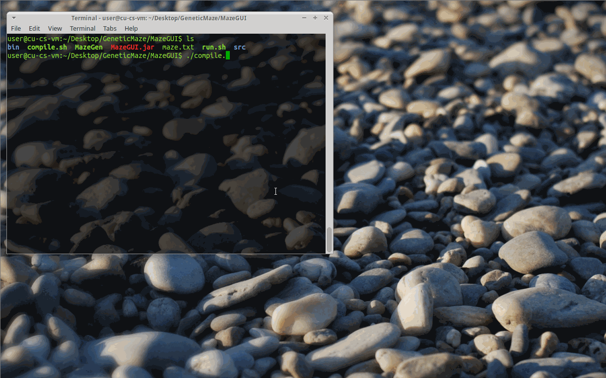

# GeneticRatMaze

 

##There are 3 programs to the Genetic Maze Project:

####1. MazeGen
* Generates a maze given size of maze, can save to file and/or print to console
* Written in C++

####2. MazeGUI
* Displays a window of the maze, read in from a generated maze file
* Reads from local 'maze.txt'
* Takes args on the path to the MazeGen executable, the size of maze to generate, and size of the cells
* The size of the cells determines the "resolution" of each wall/pathway, in pixels

####3. MazeSolve
* In development!

---

###Compiling Guide:
 * simple 'make' command, binary will be created in bin
 * use 'make clean' to clean out all binaries and compiled files

---

###Run Guide:

####MazeGen - A program written to generate mazes of specified sizes
* Default executable name is 'MazeGen'
* Used like so: <executable> <size of maze> [-o (optional output flag) <output filename>] [-p (optional force print to console)]
* Run <executable> to see examples

####MazeGUI - A GUI written in java to view the generated Maze
* Default jar-file name is 'MazeGUI.jar'
* Used like so: java -jar <jarfile> <GenMaze executable> <Maze Size> <Maze Cell Size>
* Click on the Generated Maze to re-generate it!

####MazeSolve
* In development!

